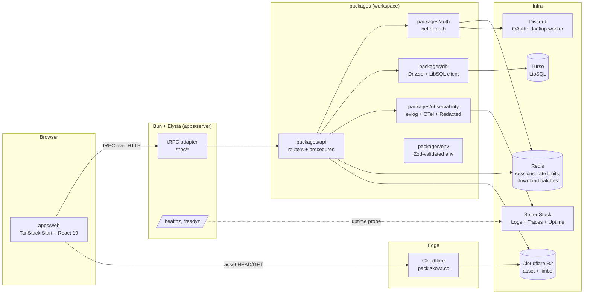
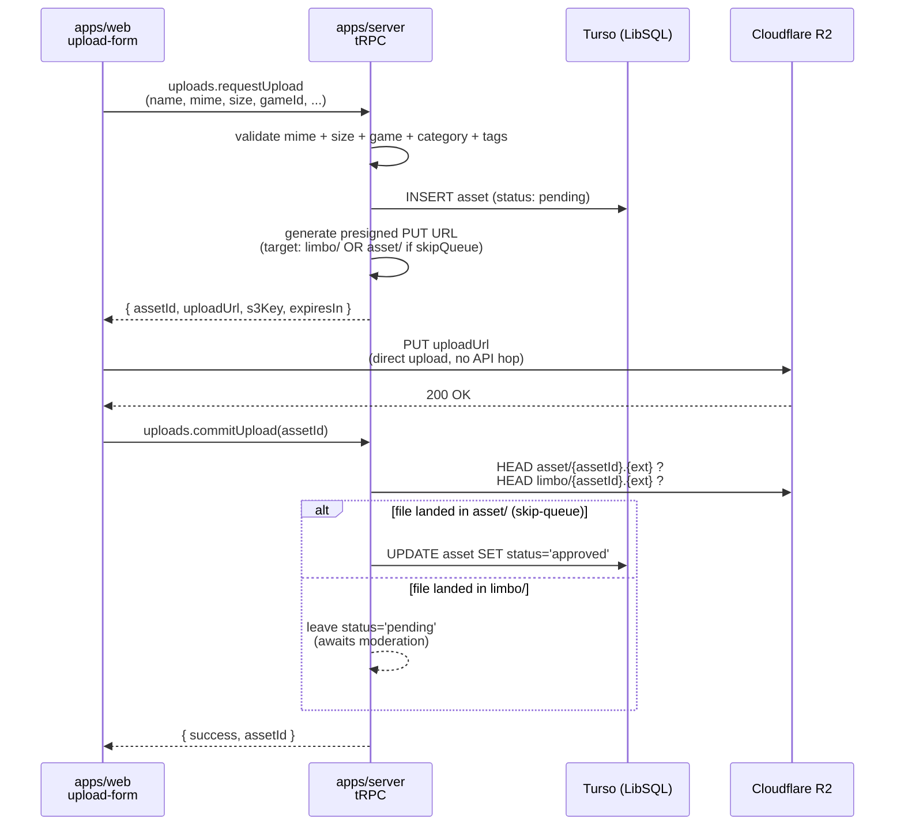
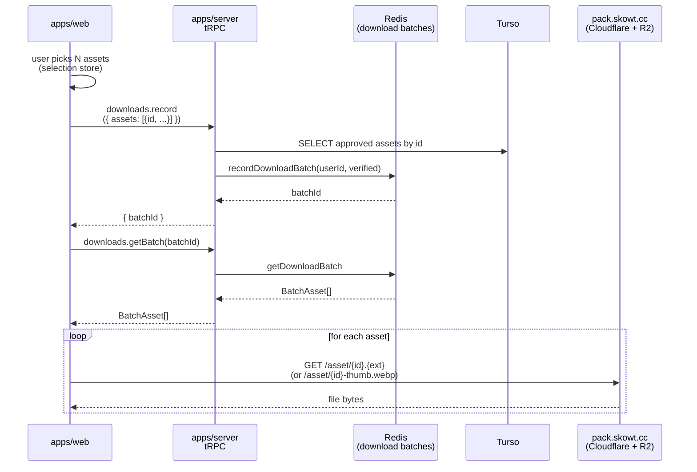

# Architecture

A walking-tour reference for the skowt.cc monorepo. Tells you which directory does what, how a request flows end-to-end, and what's deliberately _not_ solved here.

This is the public-source companion to `README.md` (project pitch + setup). Read that first if you haven't.

## System overview

`apps/web` is a TanStack Start SPA that ships its own server bundle for SSR. `apps/server` is an Elysia + Bun process that mounts the tRPC adapter, the OTel + evlog plugins, and a small set of HTTP endpoints (health + auth). Both speak to the workspace packages under `packages/*` for everything they don't own.

## Per-package responsibilities

### `apps/`

| Directory     | Purpose                                                                                                                                                                                                                                                                                  |
| ------------- | ---------------------------------------------------------------------------------------------------------------------------------------------------------------------------------------------------------------------------------------------------------------------------------------- |
| `apps/web`    | The skowt.cc frontend. TanStack Start (Router + Query) over Vite, Tailwind 4 with the `surface-*` utilities, Zustand for selection / haptic / settings stores, Motion for the few cases where CSS animation isn't enough. Talks to the API exclusively via the typed tRPC client.        |
| `apps/server` | The API runtime. Bootstraps OTel + evlog, mounts CORS, wires `loggerPlugin` into Elysia, exposes the tRPC adapter, plus `/healthz` + `/readyz` for orchestration and uptime checks. Handles graceful shutdown so SIGTERM produces a clean drain rather than a torn-mid-request log line. |

### `packages/`

| Directory                | Purpose                                                                                                                                                                                                                                                                                                                                                                                                                                                                                            |
| ------------------------ | -------------------------------------------------------------------------------------------------------------------------------------------------------------------------------------------------------------------------------------------------------------------------------------------------------------------------------------------------------------------------------------------------------------------------------------------------------------------------------------------------- |
| `packages/api`           | tRPC routers, procedure factories (`publicProcedure`, `protectedProcedure`, `contributorProcedure`, `staffProcedure`, `developerProcedure`), per-procedure rate limiting via Redis, role helpers, and the S3 / Discord / cache primitives the routers consume. The `Context` shape (session, headers, debug-id) is the only stable boundary between the runtime and the procedure code.                                                                                                            |
| `packages/auth`          | better-auth configuration. Discord OAuth flow, Drizzle adapter binding, Redis `secondaryStorage` for session caching, additional fields (`role`, `displayName`, `image`, `profileUpdatedAt`) exposed via `inferAdditionalFields`. Session reads hit Redis first; the DB is only consulted on cache miss.                                                                                                                                                                                           |
| `packages/db`            | Drizzle schema (assets, games, categories, tags, requests, comments, votes, downloads, bookmarks, auth tables) and a `tracedClient(libsqlClient)` wrapper that emits OTel spans for every query so the Better Stack DB-ops view shows real verb distribution rather than a single "FINDONE" pie. Schema is the single source of truth for both the API and migrations.                                                                                                                             |
| `packages/env`           | Zod-validated env via `@t3-oss/env-core` with a lazy singleton. Server and client schemas are separate (`@skowt-monorepo/env/server` vs `/web`) so the client bundle physically cannot reach `BETTER_AUTH_SECRET`. Test mode relaxes the prod-required vars to keep CI from needing real credentials.                                                                                                                                                                                              |
| `packages/observability` | The wide-event + tracing stack: evlog for structured per-request events, `@elysiajs/opentelemetry` for spans, a dual-drain pipeline (`stdout` + Better Stack) with per-sink failure isolation, a `Redacted<A>` newtype that denies serialization at the consumer boundary, key-name redaction as defense in depth, and a central `reportError(value, ctx)` entry point that correlates exceptions with the active span + request stats. The package exports a `loggerPlugin()` that Elysia mounts. |
| `packages/config`        | Shared tsconfig presets.                                                                                                                                                                                                                                                                                                                                                                                                                                                                           |

## Request flow walk-throughs

### Asset upload (contributor-gated)

The upload flow is a three-step ceremony (request, PUT directly to R2, commit) designed so the API process never moves bytes itself.

The skip-queue branch (`shouldSkipQueue(role) === true` for `developer` only; staff deliberately go through the queue) writes directly to the public `asset/` prefix; everyone else writes to `limbo/`, where files sit until `moderation.setStatus` (a developer procedure) moves the file from `limbo/` to `asset/` and flips status.

Why the limbo prefix exists: the CDN at `pack.skowt.cc` is publicly readable, so anything reachable in `asset/` is immediately downloadable. Pending uploads have to live somewhere CDN-invisible until a moderator confirms them.

### Asset download

There is no presigned-download flow. Files are served by Cloudflare directly from R2; card thumbnails are pre-generated `{id}-thumb.webp` objects built by the ingest pipeline, not on-the-fly transforms. The API's role in a download is _accounting_, not gatekeeping.

Single-asset views skip the batch step and just build the URL client-side via `buildAssetUrl(id, ext)` (pre-generated thumb) or `buildRawAssetUrl(id, ext)` (original).

## Design decisions

### Wide events, not log levels

Every request emits exactly one wide event at response time, enriched in place by Elysia's `derive` + `onAfterHandle`. The OTel HTTP semconv v1.27 attribute names (`http.request.method`, `url.path`, `http.response.status_code`, `duration_ms`) are emitted alongside cheap-to-query domain identity (`user_id`, `debug_id`, `rpc.methods`, `db.queries_count`, `fetch.calls_count`). The Better Stack Logs Explorer becomes a single-query observability surface for "find every request where user X hit a procedure that ran more than 50 DB queries", without opening a single trace.

`level: info / warn / error / debug` still exists on the logger surface (it's where caller-side severity goes) but it's a field on the event, not the primary axis.

### Dual drain with per-sink isolation

The drain pipeline composes a stdout drain and a Better Stack adapter under `composeDrains`. If the BS adapter rejects (token revoked, ingestion 503, network), the stdout drain still flushes the event; the failure is logged to stderr with the sink index and reason. The property under test in `packages/observability/src/server/__tests__/pipeline.test.ts` is that a BS outage during a Railway incident cannot also disable the local log stream.

### Redacted denies serialization

`Redacted<A>` (in `packages/observability/src/core/redacted.ts`) is a newtype that holds a value but throws on `toJSON`, `toString`, and template-coerce paths. Secrets enter as plain strings at the env boundary, get wrapped at consumer handoff (Better Auth secret, BS ingestion token, Discord client secret, S3 credentials), and travel as `Redacted<string>` through the rest of the codebase. Anyone accidentally logging a wrapped value gets a thrown error instead of a leak.

Defense in depth runs in the drain itself: any `Redacted` value still slipping into an event gets replaced with the literal `"<redacted>"` before the event hits stdout or BS. The allowlist of files permitted to consume `Redacted.value()` is in `docs/secret-allowlist.txt`, enforced by `bun scripts/check-secrets.ts` (not yet wired into CI).

### Tracing via Bun-native patches, not auto-instrumentation

`@opentelemetry/instrumentation-undici` and `@opentelemetry/instrumentation-ioredis` don't fire reliably under Bun because Bun's `fetch` is a native Zig implementation and ESM hooks aren't fully wired up for Bun-the-runtime. The observability package patches `globalThis.fetch` and `Redis.prototype.sendCommand` directly (idempotent via `Symbol.for(...)` markers) so every outbound HTTP call and every Redis command produces an OTel CLIENT span with HTTP / db semconv attributes. The same approach applies to `tracedClient` around libsql.

### Roles are hierarchical, not flag-bag

`UserRole = "user" | "contributor" | "staff" | "developer"`. The hierarchy is encoded in `ROLE_HIERARCHY` (a numeric ladder), and procedure factories `createMinimumRoleProcedure(min)` compare. There is no per-feature permission flag; if a feature needs finer gating than the four tiers, that's a signal to either split the role or move the gate into the procedure body with a documented reason.

### Cross-tab selection sync

The selection store (`apps/web/src/stores/selection-store.ts`) is the download cart: up to `MAX_SELECTION` (350) assets held in a Zustand store behind the `persist` middleware and written to `localStorage` under the `skowt-selection` key. Persistence alone survives a reload, but it does not keep two open tabs in agreement.

A module-level `storage` event listener closes that gap. The browser fires a `storage` event in every _other_ tab when one tab writes the key, so the handler calls `useSelectionStore.persist.rehydrate()` to re-read `localStorage` into the in-memory store. Select an asset in one tab and the cart updates in the rest, with no server round-trip, websocket, or shared worker. A `typeof window !== "undefined"` guard keeps it inert during SSR.

Only the selection store syncs live this way. Settings (`use-settings.ts`) persist but do not rehydrate on the storage event, since a stale toggle in a background tab does no harm.

## Known limitations

These are intentional gaps, not bugs to file. Calling them out so a reader doesn't burn a day rediscovering them.

- **Asset download bypass.** Files in `asset/` are served by `pack.skowt.cc` directly. The CDN URL is constructible from public `asset.id` + `extension`, both of which appear in every `asset.query` response. `downloads.record` accounts for the click but doesn't gate the bytes. A technically-literate user can fetch the URL directly and skip the accounting. A presigned-URL or worker-mediated download flow is a future redesign, not a short fix.
- **No moderation UI for tags / games / categories.** The catalogue management procedures live in `admin.router.ts` and are tested, but no FE consumes them today. They are reserved for migration to a platform-level admin surface under Antifield rather than rebuilt inside skowt.cc.
- **Single-region everything.** Turso, Redis, R2, and Better Stack are all single region. Multi-region is a future Antifield-platform concern, not a skowt.cc concern.
- **No background job queue.** Anything that needs to run after the response (Discord profile refresh, `view_count` increment) runs as `void doThing()` from inside the request scope with `fire-and-forget`. The `endRequestStats()` in `loggerPlugin`'s `onAfterResponse` clears the AsyncLocalStorage frame so the post-response bumps don't poison the already-emitted wide event, but the work itself is not durable across process crashes.

## Conventions

### Verbs

Exported function names at boundary surfaces (package indices, router files, `apps/web/src/lib`) follow:

| Verb prefix                      | Meaning                                                                 |
| -------------------------------- | ----------------------------------------------------------------------- |
| `get*`                           | Cached or local read. Returns the thing or throws if it has to.         |
| `fetch*`                         | Remote read / IO. Returns the thing or throws.                          |
| `find*`                          | May not exist. Returns `T \| null`.                                     |
| `load*`                          | Hydration from storage into a richer in-memory form.                    |
| `is*` / `can*` / `has*`          | Boolean predicates.                                                     |
| `build*`                         | Pure construction. No IO.                                               |
| `transform*`                     | API DTO shape -> domain model.                                          |
| `wrap*` / `with*`                | Decorator / middleware / span helper.                                   |
| `bump*` / `record*` / `enqueue*` | Side-effect on a counter, store, or queue. No return value worth using. |

The repo conventions for short identifiers (`db`, `s3`, `cdn`, `r2`, `bs`) are the only abbreviations allowed in exported names. `*Helper` and `*Util` suffixes are not. Deeper renames inside router bodies and component implementations are applied opportunistically as files are touched, not as a sweep.

### `surface-*` utilities

Surface-level styling goes through the `surface-*` utility classes defined in `apps/web/src/index.css` (`surface-raised`, `surface-accent-solid`, `surface-well`, `surface-glass`, ...). Hand-rolled bevels via `boxShadow: inset ...` are reserved for cases the palette doesn't cover (e.g. selection rings); they are not a stand-in for "I didn't find the right class". Dynamic inline `style={{}}` is fine for genuinely runtime values (animation transforms, progress widths, aspect ratios). Static cosmetic values belong in a `surface-*` utility or a Tailwind class.

### Comments

Comments use lowercase prose with no trailing period. They explain _why_, not _what_; well-named identifiers carry the _what_ (identifiers, acronyms, and proper nouns keep their real casing). Marketing adjectives and meta-narration get cut; named actors and specific call sites are preferred over generic phrasing. A multi-line explanation is one `/* */` block, not a stack of `//` lines, and never an empty `//` used as a spacer.

## See also

- `README.md` - local dev setup, stack at a glance, package table.
- `SECURITY.md` - disclosure policy and scope.
