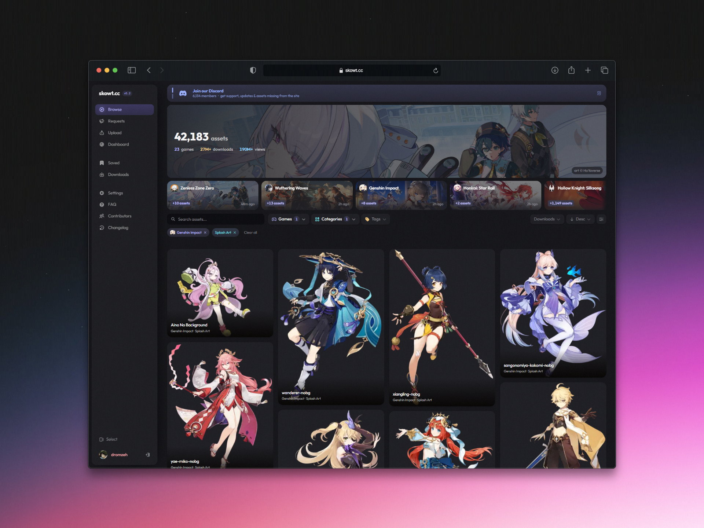

<p align="center">
  <h1 align="center">skowt.cc</h1>
  <p align="center">Source code for skowt.cc, a centralised game asset database.</p>
  <p align="center">
    <a href="https://discord.gg/noid"></a>
    <a href="https://railway.com?referralCode=antifield"></a>
    
    <a href="LICENSE"></a>
  </p>
</p>

> [!WARNING]
> **skowt.cc is source-available, not open source.** You are welcome to read the code and learn from it, but you may not copy, run, deploy, or clone it. Read the [LICENSE](LICENSE) first.

[](https://skowt.cc)

---

## Stack

Built on TanStack Start, Elysia, tRPC, Tailwind, better-auth, Drizzle ORM and Turso (LibSQL). `@skowt-monorepo/observability` (built on evlog) handles wide structured event logging + OTel traces, shipping to Better Stack via the native logs adapter and OTLP for traces. `Redacted<A>` denies secret serialization at consumer boundaries (see `docs/secret-allowlist.txt`).

| App           | Tech                                                                     |
| ------------- | ------------------------------------------------------------------------ |
| `apps/web`    | React 19, TanStack Start/Router/Query, Vite, Tailwind 4, Zustand, Motion |
| `apps/server` | Elysia, tRPC, better-auth, Drizzle ORM                                   |

| Package                  | Purpose                                                                                                                  |
| ------------------------ | ------------------------------------------------------------------------------------------------------------------------ |
| `packages/api`           | tRPC routers, rate limiting, role auth, Redis batch downloads                                                            |
| `packages/db`            | Drizzle schema, migrations, LibSQL client, seed                                                                          |
| `packages/auth`          | better-auth config, session and cookie setup                                                                             |
| `packages/env`           | Zod-validated env with `@t3-oss/env-core`, lazy singleton                                                                |
| `packages/observability` | evlog-based wide-event logging + OTel traces + `Redacted<A>` + Elysia plugin; ships to Better Stack with stdout fallback |
| `packages/config`        | Shared tsconfig                                                                                                          |

Some pieces worth reading if you're here for the patterns: the wide-event observability pipeline and Bun-native OTel patches in `packages/observability`, the Lua sliding-window rate limiter and opaque keyset cursors in `packages/api`, and the FTS5 trigram search setup in `packages/db`. [ARCHITECTURE.md](ARCHITECTURE.md) is the walking tour.

## Local Dev Setup

Prerequisites: [Bun](https://bun.sh) ≥ 1.3, a running Docker daemon (compose v2), and network access (seeding pulls live catalog data from the production API).

1. Clone and install

```sh
gh repo clone skowtcc/monorepo && cd monorepo && bun i
```

2. Copy env files

```sh
cp apps/server/.env.example apps/server/.env
cp apps/web/.env.example apps/web/.env
```

3. (Optional) configure Discord OAuth in `apps/server/.env`. Without it the app runs in a degraded dev mode: sign-in is disabled and the Discord-membership gate on downloads/bookmarks defaults open, which is fine for most frontend/API work. To enable the full auth flow, create an app in the [Discord developer portal](https://discord.com/developers/applications), add `http://localhost:13387/api/auth/callback/discord` as an OAuth redirect URI, and fill in `DISCORD_CLIENT_ID` / `DISCORD_CLIENT_SECRET`.

4. Run it

```sh
bun dev
```

Then open http://localhost:1337 (the API listens on http://localhost:13387).

The dev script spins up Docker infrastructure (LibSQL, Redis, LocalStack), waits for health checks, pushes the DB schema, seeds data, and starts the frontend and backend. When you Ctrl+C, the containers are torn down.

Data does not persist between restarts. This is intentional.

If the containers are already running and you just want the app servers:

```sh
bun dev:noinf
```

### Common commands

| Command                                      | What it does                                               |
| -------------------------------------------- | ---------------------------------------------------------- |
| `bun run test`                               | test suites across workspaces (api needs the dev infra up) |
| `bun run check-types`                        | typecheck via turbo                                        |
| `bun db:studio`                              | drizzle studio against the dev database                    |
| `bun db:push` / `bun db:seed` / `bun db:fts` | schema push, seed data, FTS5 index provisioning            |

### Infrastructure (Dev)

Spun up automatically by `bun dev` via `docker-compose.dev.yml`:

| Service    | Port | Purpose                                |
| ---------- | ---- | -------------------------------------- |
| LibSQL     | 8082 | Turso-compatible database              |
| Redis      | 6383 | Caching, rate limits, download batches |
| LocalStack | 9004 | S3-compatible asset storage            |

## Docs

- [ARCHITECTURE.md](ARCHITECTURE.md) - how the pieces fit together
- [SECURITY.md](SECURITY.md) - reporting vulnerabilities

## Licence

skowt.cc's source is published for transparency, so you can read and learn from
how it is built. It is not open source. You are welcome to read, study, and take
ideas from the code, but you may not copy it, run it, deploy it, or ship a clone.
See [LICENSE](LICENSE) and [TRADEMARK.md](TRADEMARK.md). For anything beyond
reading, email marcel@antifield.com.

© 2026 Antifield LTD · Company No. 15988228 · skowt.cc since 2022
